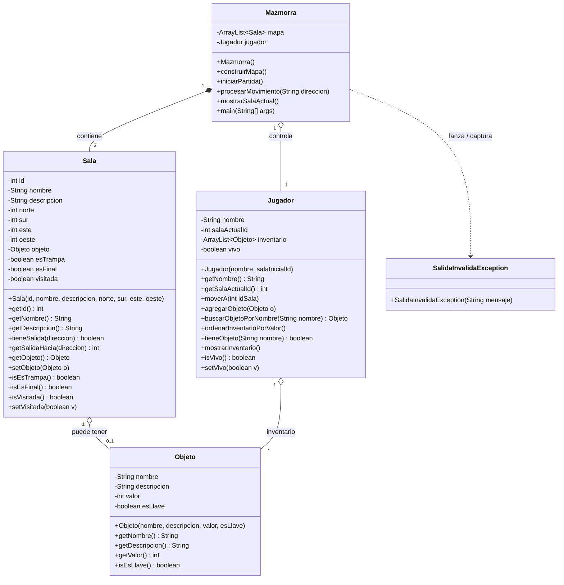

# Diagrama de Clases — La Mazmorra Medieval

Proyecto Integrador Final · Informática I · UPA
Grupo 9: Sebastián Ayala y Esteban Ayala
Categoría: Aventura de texto (exploración) · Ambientación: Mazmorra medieval

Este diagrama se entrega ANTES de empezar a programar, según lo pedido en la consigna. GitHub renderiza el bloque `mermaid` de abajo automáticamente al ver este archivo en el repositorio.

## Cómo se cumplen los requisitos técnicos mínimos

| Requisito | Dónde |
|---|---|
| 2-3 clases encapsuladas | `Sala`, `Objeto`, `Jugador` (atributos privados, constructor, getters/setters) |
| Estructura de datos estándar | `ArrayList<Sala>` en `Mazmorra` (el mapa) y `ArrayList<Objeto>` en `Jugador` (inventario) |
| Excepción personalizada | `SalidaInvalidaException extends Exception` |
| Algoritmo de búsqueda/ordenamiento | Búsqueda lineal en `Jugador.buscarObjetoPorNombre()`; ordenamiento (Bubble Sort) en `Jugador.ordenarInventarioPorValor()` |
| Menú funcional de principio a fin | `Mazmorra.main()` con menú por consola (moverse, ver inventario, usar objeto, salir) |
